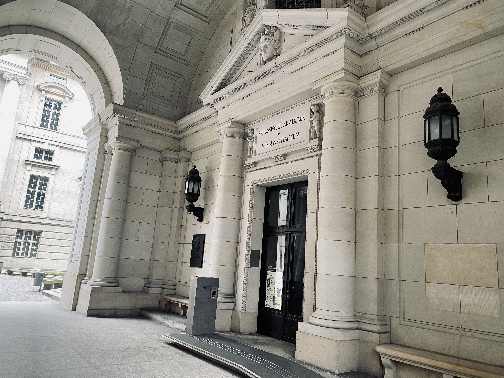

The focus of this city walk is not on the usual historical depictions of supposedly well-known eras. It is on the mysterious, the hidden and the unfinished. The perspective is global.

We take a journey into the 17th & 18th centuries. At that time, Berlin was the residence of the Electors of Brandenburg, who were allowed to call themselves "Kings in Prussia" from 1701 onwards. In this city we meet adventurers, alchemists, necromancers, impostors, a queen of the muses and a king of philosophers. We also get to know famous, infamous and above all influential societies of that age, which was rarely as "enlightened" as we would like to believe.  You can find more information below under "Highlights".

Starting with the magnificent buildings on the Gendarmenmarkt and around the Forum Fridericianum (today: Bebelplatz), I will convey to you the zeitgeist of an era that is strangely foreign and familiar to us. The contemporary relevance of the Age of Enlightenment will come up again and again. Our walk ends with a view of Berlin's landmark, the Brandenburg Gate, because this too is a product of the Age of Enlightenment!

## Interested? Get in touch!

Right now the city walk is bookable via https://www.guruwalk.com/de/walks/59673-geheimnisse-von-berlin-das-zeitalter-der-aufklarung and https://www.freetour.com/berlin/secrets-of-berlin-the-age-of-enlightenment
